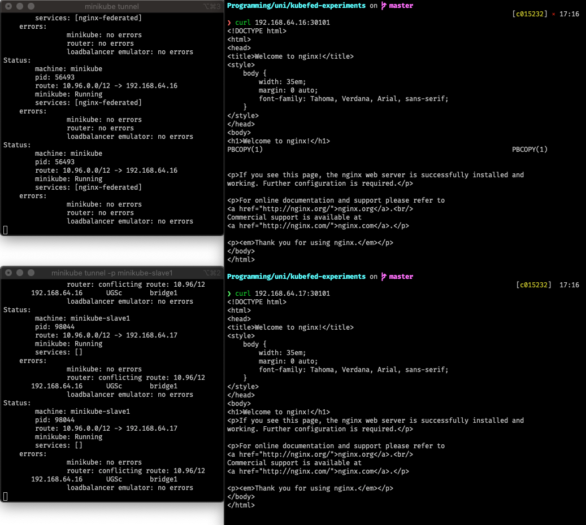

# Federated Kubernetes

Deploy clusters

```
minikube start & minikube start -p minikube-slave1 & wait

kubectx minikube
```

Deploy kubefed helm chart

`kubefed join` all clusters

Check if all clusters have joined the federation
```
kubectl get kubefedclusters -n kube-federation-system
```

Enable federation for deployments and services
```
kubefedctl enable deploy
kubefedctl enable service
```

Deploy demo application to the cluster
```
kubectl apply -f nginx-federated-demo/deploy/
```

Setup tunnels for both Minikube instances in different shells

Try to access the service to see if it has launched correctly
